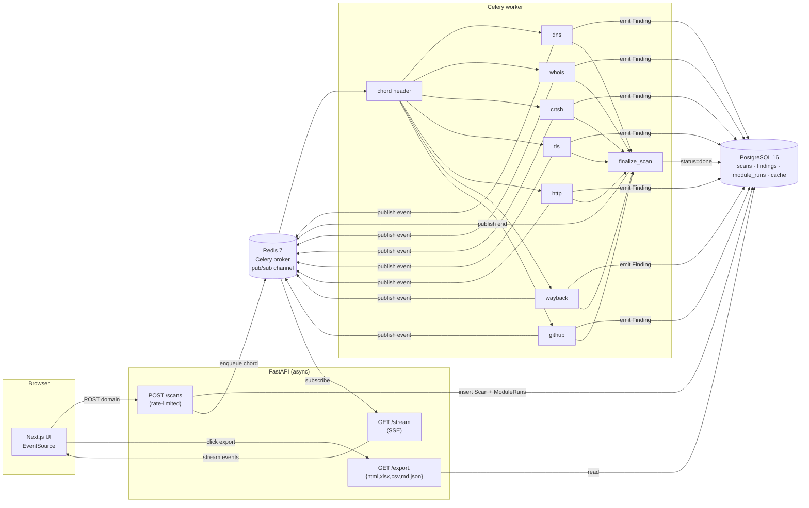

# recon-dashboard-yh

> Self-hosted OSINT & passive reconnaissance dashboard. Type a domain — watch seven independent modules stream findings into a live UI, then export as HTML / Excel / CSV / Markdown / JSON.


<!-- Replace with docs/img/demo.gif once recorded -->
<!--  -->

## Why this exists

This is a portfolio project that demonstrates how I approach **security-aware web application engineering**: a real-world fan-out pipeline, streamed over a persistent connection, hardened against abuse, and wrapped in a UI a non-engineer can actually use.

Every feature was chosen because it shows something concrete:

| Feature | What it demonstrates |
|---|---|
| **7 parallel recon modules via Celery chord** | Non-trivial async/concurrency (async FastAPI + sync workers against the same DB, clean fan-out/fan-in) |
| **Server-Sent Events over Redis pub/sub** | Real-time systems — no polling, no WebSocket ceremony, sub-second end-to-end latency |
| **SSRF / abuse gate + rate limiting + passive-only modules** | Security-first design: think about misuse before shipping |
| **Per-(domain, module) result cache with module-specific TTLs** | Operational thinking — respecting upstream services |
| **HTML/Excel/CSV/Markdown export + smart in-page tables** | Product empathy: JSON is for machines, users get the format they actually need |
| **Hermetic test suite** | Testing discipline: no network, no DB, still meaningful |
| **Docker Compose one-command self-host** | Ops awareness: anyone can run this in 60 seconds |

## Quick start

```bash
git clone https://github.com/Youness-Harrizi/recon-dashboard-yh.git
cd recon-dashboard-yh
cp .env.example .env
docker compose up --build
```

Then open:

- **Web UI:** http://localhost:3000
- **API docs:** http://localhost:8000/docs
- **Health:** http://localhost:8000/health

Submit `example.com` — you'll see seven module cards transition `pending → running → done` as findings stream in.

## Recon modules

| Module    | What it does                                                          | Source                                        |
|-----------|-----------------------------------------------------------------------|-----------------------------------------------|
| `dns`     | A/AAAA/MX/NS/TXT/CNAME/SOA records; flags missing SPF / DMARC        | `dnspython`                                   |
| `whois`   | RDAP: registrar, registration/expiration, nameservers, status        | `rdap.org` → authoritative RDAP server        |
| `crtsh`   | Subdomain enumeration from Certificate Transparency logs             | `crt.sh`                                      |
| `tls`     | :443 handshake, cert parsing, expiry-based severity tiering          | stdlib `ssl`                                  |
| `http`    | GETs `/`, inspects headers, flags missing security headers           | direct HTTPS                                  |
| `wayback` | Historical URLs for the domain                                       | `web.archive.org` CDX API                     |
| `github`  | Public code mentioning the domain (optional — needs `GITHUB_TOKEN`)  | GitHub code search API                        |

Modules implement a tiny Protocol ([backend/app/recon/base.py](backend/app/recon/base.py)) and register themselves in [registry.py](backend/app/recon/registry.py). Adding a new module is ~30 lines.

## Architecture



**Key flows:**

- **Submit.** `POST /api/v1/scans` validates the domain (SSRF gate), inserts a `Scan` + one `ModuleRun` per module, dispatches a Celery chord, returns 201.
- **Execute.** Each worker task checks the `domain_cache` table; on hit it replays cached findings, on miss it runs the module, persists each `Finding` as it's emitted, and stores the batch back into the cache with a per-module TTL.
- **Stream.** Workers publish every state change (`module_run`, `finding`, `scan`) on `scan:<id>` in Redis. The SSE endpoint subscribes, sends an initial snapshot, then forwards events until `end`. Browser uses `EventSource`; falls back to polling on failure.
- **Finalize.** The chord callback flips `Scan.status` to `done`/`failed` and publishes the terminal event.

## API

```
POST /api/v1/scans                    { "domain": "example.com" } → Scan   (10/min/IP)
GET  /api/v1/scans                    → Scan[] (most recent first)
GET  /api/v1/scans/{id}               → ScanDetail (findings + module_runs)
GET  /api/v1/scans/{id}/stream        → SSE: snapshot, module_run, finding, scan, end
GET  /api/v1/scans/{id}/export.html   → self-contained HTML report (printable to PDF)
GET  /api/v1/scans/{id}/export.xlsx   → Excel workbook (Overview / Findings / Modules sheets)
GET  /api/v1/scans/{id}/export.csv    → flat findings table (UTF-8 BOM, opens in Excel)
GET  /api/v1/scans/{id}/export.md     → Markdown report
GET  /api/v1/scans/{id}/export.json   → raw JSON
GET  /health                          → dependency status
```

Full OpenAPI spec at http://localhost:8000/docs.

## Security & ethics

**Scope.** This tool performs **passive-ish** reconnaissance: public DNS queries, RDAP, Certificate Transparency lookups, the Wayback Machine, a single TLS handshake, and one HTTP GET of the root page. It **does not** port-scan, brute-force subdomains, crawl, or probe vulnerabilities.

**Abuse defenses built in:**

- Input validator rejects IPs, `localhost`, and reserved TLDs (`.local`, `.internal`, `.arpa`, etc.) — see [domain_validator.py](backend/app/services/domain_validator.py).
- `POST /scans` is rate-limited (10/min/IP) via slowapi.
- No redirect following to internal hosts from the HTTP module (httpx defaults + explicit HTTPS scheme).
- GitHub module skips gracefully without a token instead of noisily failing.

**Use it only against domains you own or have explicit permission to assess.** This project exists to demonstrate engineering, not to facilitate unauthorized testing.

## Development

### Run the test suite

```bash
docker compose exec backend pytest
```

Hermetic: patches `dns.resolver`, no network/DB needed. Covers the domain validator (accept/reject matrix + IDN punycode), registry invariants, and the DNS module.

### Project layout

```
backend/
  app/
    api/            routes_scans.py, routes_stream.py
    recon/          base.py, registry.py, dns_records.py, whois_rdap.py, …
    services/       domain_validator.py, orchestrator.py, events.py, cache.py, exporters.py
    workers/        celery_app.py, tasks.py
    models/         scan.py, finding.py, module_run.py, cache.py
    schemas/        (Pydantic)
  tests/            test_domain_validator.py, test_registry.py, test_dns_module.py
  alembic/          versions/0001_initial.py
web/
  src/app/          page.tsx, scan/[id]/page.tsx, scan/[id]/FindingData.tsx
  src/lib/api.ts    typed API client
docker-compose.yml
```

### Add a new recon module

1. Drop `backend/app/recon/my_module.py`:
   ```python
   class MyModule:
       name = "mymodule"
       passive = True
       def run(self, ctx: Context) -> None:
           ctx.emit(FindingDraft(module=self.name, title="hello", data={}))
   ```
2. Register it in [registry.py](backend/app/recon/registry.py).
3. Optionally add a TTL in [cache.py](backend/app/services/cache.py) `MODULE_TTL`.

### Migrations

Alembic runs `upgrade head` on backend container startup. To add one:

```bash
docker compose exec backend alembic revision --autogenerate -m "describe change"
```

## License

MIT — see [LICENSE](LICENSE).

---

Built as a portfolio project. Feedback and questions welcome — open an issue.
